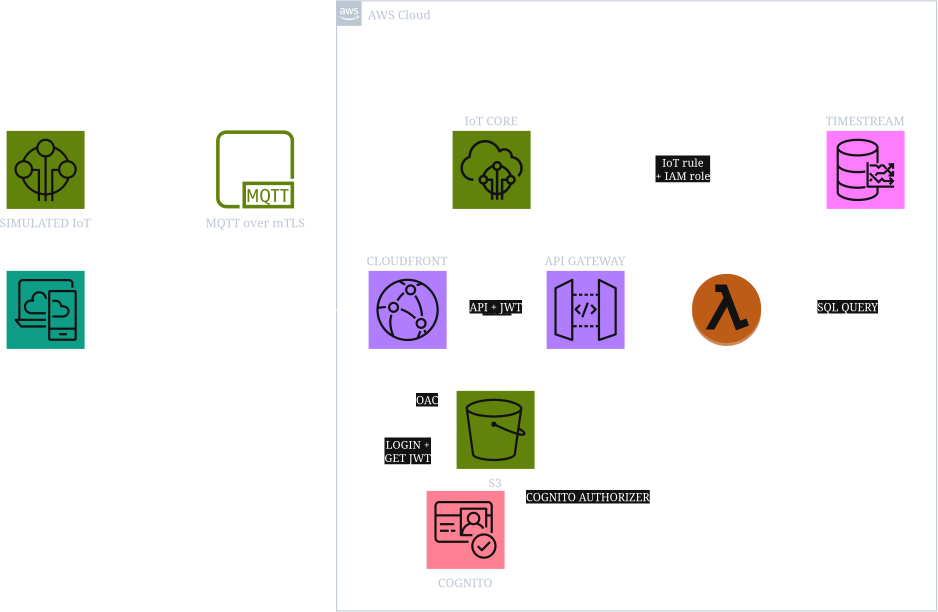

# AWS IoT

This project aims to explore and develop infrastructure that supports IoT.

## Cloud Architecture

> *Figure 1: High-level architecture showing flow between different services such as iot, api gateway, and database.*

## Prerequisite

- **AWS CLIv2**: login using `aws login`. Make sure you have the proper authentication.