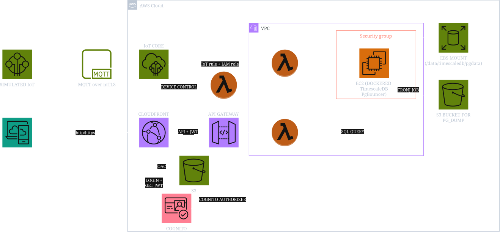

# AWS IoT Fleet Monitoring & Control Platform

A full-stack, enterprise-grade IoT platform built on AWS infrastructure. This repository provides end-to-end telemetry ingestion, self-hosted time-series storage, serverless REST query and control APIs, secure Cognito user authentication, global CloudFront CDN static hosting, automated CI/CD security scanning, and a modern Astro.js web dashboard.

---

## Cloud Architecture

> *Figure 1: End-to-end architecture showcasing device mTLS telemetry ingestion, self-hosted TimescaleDB on EC2, Serverless API Gateway & Lambda query/control layers, Cognito authentication, CloudFront CDN static hosting, Astro.js frontend dashboard, and GitHub Actions CI/CD with Checkov security scanning.*

---

## What It Does

This platform provides a complete **bi-directional IoT fleet management system**:

1. **Telemetry Streaming**: Virtual IoT devices send encrypted mTLS MQTT telemetry streams (temperature, humidity, battery, status) to AWS IoT Core.
2. **High-Throughput Ingestion**: AWS IoT Topic Rules trigger a VPC-attached Node.js Ingestor Lambda to write raw metrics into a self-hosted TimescaleDB hypertable on EC2 via PgBouncer.
3. **Time-Series Aggregation & Querying**: A Query Lambda executes PostgreSQL `time_bucket()` aggregations over configurable time windows (`1h`, `24h`, `7d`).
4. **User Authentication**: AWS Cognito User Pools & JWT Authorizers enforce secure identity management for web clients.
5. **Bi-Directional Downstream Control**: Web dashboard users can dispatch real-time commands (`SET_INTERVAL`, `RESTART`) via API Gateway → Control Lambda → AWS IoT Data Plane back to specific edge devices over mTLS MQTT.
6. **Web Monitoring Dashboard**: An Astro.js single-page web app renders live telemetry charts and interactive device control panels.
7. **Global Static Hosting & CDN**: CloudFront CDN distribution backed by an S3 origin with Origin Access Control (OAC) delivers the frontend globally over HTTPS with zero public S3 bucket access.
8. **Automated CI/CD & Security**: GitHub Actions pipeline automates HCL formatting, Checkov IaC security scanning, Astro static builds, Terraform infrastructure deployment, and CloudFront cache invalidation.

---

## Key Components, Functions, & UI/UX

For a detailed technical breakdown of each system component (Edge Devices & Simulator, TimescaleDB & PgBouncer, Serverless Lambdas & API Gateway, Cognito Auth, CloudFront CDN, and CI/CD Pipeline) as well as the Astro.js frontend UI/UX features, see the [Platform Technical & UI/UX Documentation](./docs/README.md).

---

## CI/CD Deployment IAM Policy (`deployer-policy.json`)

To enable automated deployments via GitHub Actions or OIDC execution roles, attach the IAM policy defined in [`deployer-policy.json`](./deployer-policy.json) to your deployment runner role.

### Required Service Permissions Summary:

| AWS Service | Required Actions | Purpose |
| :--- | :--- | :--- |
| **S3** | `s3:*` | Manage Terraform state, backup buckets, & static frontend assets |
| **CloudFront** | `cloudfront:*` | Provision CDN distributions, OAC, & edge cache invalidations |
| **ACM** | `acm:*` | Request & validate SSL/TLS certificates for custom domain hosting |
| **Lambda** | `lambda:*` | Manage Ingestor, Query, and Control Lambda functions |
| **API Gateway** | `apigateway:*` | Provision HTTP API v2 routes, integrations, and authorizers |
| **Cognito IDP** | `cognito-idp:*` | Manage User Pools, App Clients, and authentication settings |
| **AWS IoT** | `iot:*` | Manage IoT Core Topic Rules, Policies, Things, and Certificates |
| **EC2 & VPC** | `ec2:*` | Manage EC2 instances, EBS volumes, SGs, & VPC Endpoints |
| **CloudWatch Logs**| `logs:*` | Manage log groups and log streams for Lambda & IoT Core |
| **SSM** | `ssm:*` | Read & write SecureString database password parameters |
| **DLM** | `dlm:*` | Manage Data Lifecycle Manager EBS snapshot policies |
| **IAM** | `iam:*Role*`, `iam:*InstanceProfile*` | Provision execution roles, policies, and instance profiles |

---

## Prerequisites

- **AWS CLI v2**: Logged in via `aws configure` or `aws login`.
- **Terraform** (`>= 1.15.6`): Infrastructure provisioner.
- **Node.js** (`>= 20.0.0`): For running the Astro frontend and building Lambda functions.
- **Docker / Podman**: For running the local Python device simulator.
- **aws-session-manager-plugin**: For secure SSM Session Manager access to the EC2 database instance (`aws ssm start-session`).
