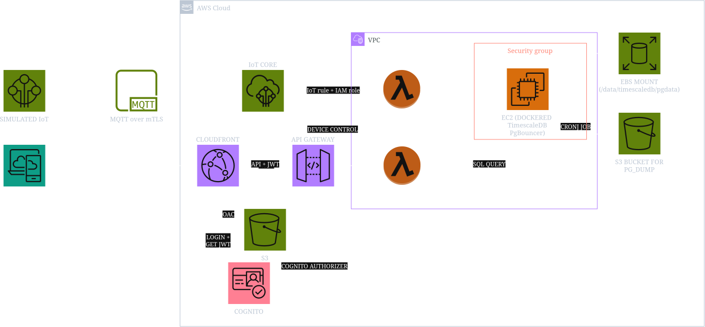

# AWS IoT Fleet Monitoring & Control Platform

A full-stack, enterprise-grade IoT platform built on AWS infrastructure. This repository provides end-to-end telemetry ingestion, self-hosted time-series storage, serverless REST query and control APIs, secure Cognito user authentication, global CloudFront CDN static hosting, and a modern Astro.js web dashboard.

---

## Cloud Architecture

> *Figure 1: End-to-end architecture showcasing device mTLS telemetry ingestion, self-hosted TimescaleDB on EC2, Serverless API Gateway & Lambda query/control layers, Cognito authentication, CloudFront CDN static hosting, and Astro.js frontend dashboard.*

---

## What It Does

This platform provides a complete **bi-directional IoT fleet management system**:

1. **Telemetry Streaming**: Virtual IoT devices send encrypted mTLS MQTT telemetry streams (temperature, humidity, battery, status) to AWS IoT Core.
2. **High-Throughput Ingestion**: AWS IoT Topic Rules trigger a VPC-attached Node.js Ingestor Lambda to write raw metrics into a self-hosted TimescaleDB hypertable on EC2 via PgBouncer.
3. **Time-Series Aggregation & Querying**: A Query Lambda executes PostgreSQL `time_bucket()` aggregations over configurable time windows (`1h`, `24h`, `7d`).
4. **User Authentication**: AWS Cognito User Pools & JWT Authorizers enforce secure identity management for web clients.
5. **Bi-Directional Downstream Control**: Web dashboard users can dispatch real-time commands (`SET_INTERVAL`, `RESTART`) via API Gateway → Control Lambda → AWS IoT Data Plane back to specific edge devices over mTLS MQTT.
6. **Web Monitoring Dashboard**: An Astro.js single-page web app renders live telemetry charts and interactive device control panels.
7. **Global Static Hosting & CDN**: CloudFront CDN distribution backed by an S3 origin with Origin Access Control (OAC) delivers the frontend globally over HTTPS with zero public S3 bucket access.

---

## Key Components & Functions

### 1. Edge Devices & Simulator (`simulator/`)
- **Python mTLS Simulator** (`device_sim.py`): Multi-device simulation (`sim-01`, `sim-02`) using the `awsiotsdk` Python client over X.509 mTLS.
- **Dynamic Subscriber**: Listens on `telemetry/{CLIENT_ID}/control` for downstream commands and dynamically updates publishing intervals or simulates reboot cycles.
- **Containerized Deployment**: Docker Compose stack (`docker-compose.yml`) with live code volume mounts.

### 2. Time-Series Storage Layer (`terraform/ec2_timescaledb.tf`)
- **Self-Hosted TimescaleDB**: `timescale/timescaledb:2.29.0-pg17` running on EC2 `t3.medium`.
- **PgBouncer Connection Pooler**: Transaction-mode connection pooling (`edoburu/pgbouncer:v1.25.2-p0`) listening on port `6432`.
- **EBS Persistent Storage**: Dedicated 20 GB `gp3` volume formatted with EXT4, mounted at `/data/timescaledb/pgdata` (`lost+found` conflict isolated).
- **Automated Snapshots & Backups**: AWS Data Lifecycle Manager (DLM) daily volume snapshots and scheduled S3 `pg_dump` backups.
- **Secrets Management**: Random 24-character password generated and stored as a `SecureString` in AWS SSM Parameter Store.

### 3. Serverless API Layer (`terraform/`)
- **HTTP API Gateway v2** (`api_gateway.tf`): CORS-configured REST endpoints backed by a Cognito JWT Authorizer.
  - `GET /telemetry`: Retrieves time-bucketed telemetry aggregates.
  - `POST /devices/{device_id}/control`: Publishes downstream MQTT commands to edge devices.
- **VPC Ingestor Lambda** (`lambda_ingestor.tf`): Ingests MQTT payloads into TimescaleDB.
- **VPC Query Lambda** (`lambda_query.tf`): Executes time-series SQL aggregation queries.
- **Control Lambda** (`lambda_control.tf`): Uses `@aws-sdk/client-iot-data-plane` to publish commands to `telemetry/{device_id}/control`.
- **SSM VPC Interface Endpoint** (`aws_vpc_endpoint.ssm`): Grants Lambda functions inside the VPC private, secure access to Parameter Store without NAT Gateway costs.

### 4. User Authentication & Authorization (`terraform/cognito.tf`)
- **Cognito User Pool**: User directory enforcing strong password policies and email authentication.
- **Cognito App Client**: Configured for SPA frontends (`ALLOW_USER_SRP_AUTH`, `ALLOW_USER_PASSWORD_AUTH`, `ALLOW_REFRESH_TOKEN_AUTH`).

### 5. Static Hosting & CDN (`terraform/static_hosting.tf`)
- **Private S3 Frontend Bucket**: `aws_s3_bucket.frontend_bucket` storing Astro static site build artifacts (`frontend/dist`) with 100% public access blocked.
- **Origin Access Control (OAC)**: `aws_cloudfront_origin_access_control` enabling SigV4 signed requests from CloudFront to S3.
- **CloudFront CDN Distribution**: `aws_cloudfront_distribution` delivering low-latency static assets over HTTPS with SPA custom error page redirects (`403`/`404` -> `/index.html`).
- **CloudFront Function**: `aws_cloudfront_function.astro_router` rewriting subfolder URIs (e.g. `/login` -> `/login/index.html`) for Astro SSG routing.
- **Restricted S3 Bucket Policy**: `aws_s3_bucket_policy` granting `s3:GetObject` permissions strictly to the CloudFront distribution ARN.

---

## UI & UX (`frontend/`)

Built with **Astro.js** and **React**, the frontend web dashboard provides a sleek, modern dark-mode monitoring interface:

- **Cognito Authentication View**: User login page (`login.astro`) with token session persistence (`sessionStorage`).
- **Device & Range Selectors**: Switch seamlessly between devices (`sim-01`, `sim-02`) and time windows (`1h`, `24h`, `7d`).
- **Time-Series Charts**: Interactive telemetry charts rendering temperature (°C), humidity (%), and battery (%) trends.
- **Interactive Control Panel**:
  - **Dynamic Publish Interval**: Range slider / numeric input allowing users to alter a device's telemetry frequency live over MQTT (`SET_INTERVAL`).
  - **Reboot Trigger**: Button to trigger a simulated reboot cycle (`RESTART`).
  - **Live Toasts**: Real-time feedback showing command execution status (`SUCCESS`).

---

## Prerequisites

- **AWS CLI v2**: Logged in via `aws configure` or `aws login`.
- **Terraform** (`>= 1.15.6`): Infrastructure provisioner.
- **Node.js** (`>= 20.0.0`): For running the Astro frontend and building Lambda functions.
- **Docker / Podman**: For running the local Python device simulator.
- **aws-session-manager-plugin**: For secure SSM Session Manager access to the EC2 database instance (`aws ssm start-session`).

